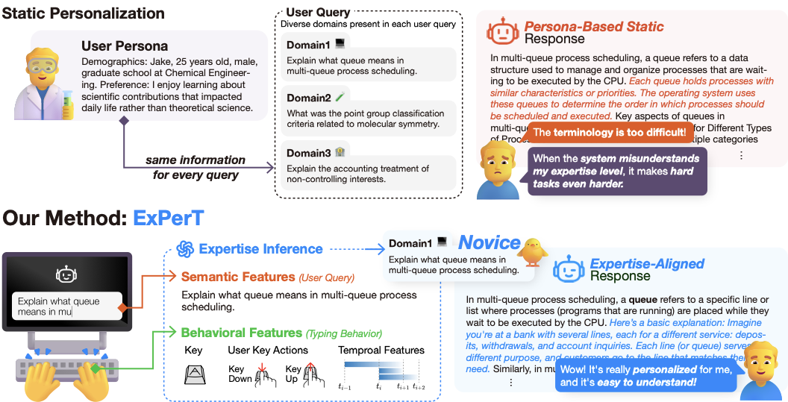

# ExPerT

ExPerT: Personalizing LLM Responses to Users' Domain Expertise via Query-Wise Semantic and Keystroke Behavioral Cues  
Yeji Park, Jiwon Tark, and Taesik Gong  
ACL'26: Proceedings of the 63rd Annual Meeting of the Association for Computational Linguistics  

## Overview

This repository contains preprocessing code for keystroke-level query typing data.
The main script, `preprocess.py`, reads a raw CSV file, builds key-pair timing features,
and exports either word-level or query-level aggregated features.

## Main Figure



## Project Structure

```text

├── preprocess.py
├── README.md
└── data/
    ├── raw_keydata.csv
    ├── preprocessed_word.csv
    └── preprocessed_query.csv
```

## Raw Key Data

`raw_keydata.csv` includes at these columns:

- `user_id`
- `session_id`
- `query`
- `task`
- `expertise`
- `key_name`
- `key_down_time`
- `key_up_time`


## What `preprocess.py` Does

The preprocessing pipeline runs in two stages.

1. Base preprocessing
   - Loads the raw keystroke log
   - Sorts records by user, query, and key-down timestamp
   - Assigns `word_group` labels for each key event
   - Builds adjacent key pairs (`key1`, `key2`)
   - Computes timing features:
     - `Duration_key1`
     - `Duration_key2`
     - `DD_time`
     - `UD_time`
     - `UU_time`
     - `DU_time`

2. Aggregation
   - `word` mode: aggregates features by query, user, expertise, word group, and task
   - `query` mode: aggregates features by query, user, expertise, and task

The script also creates a formatted `typing_features` text column for downstream analysis.

## Usage

### Word-Level Features

```bash
python preprocess.py \
  --input_path ./data/raw_keydata.csv \
  --output_path ./data/preprocessed_word.csv \
  --preprocess_mode word
```

### Query-Level Features

```bash
python preprocess.py \
  --input_path ./data/raw_keydata.csv \
  --output_path ./data/preprocessed_query.csv \
  --preprocess_mode query
```

## Arguments

- `--input_path`: path to the input CSV file
- `--output_path`: path to the output CSV file
- `--preprocess_mode`: one of `word`, `query`, or `only_query`


## Output Files

Running the script produces:

- The file specified by `--output_path`
- `preprocessed_raw.csv`, which is automatically generated during preprocessing and contains the pair-level timing features before aggregation

## Output Schema Summary

Word-level output typically includes:

- `query`
- `user_id`
- `expertise`
- `word_group`
- `task`
- aggregated timing statistics such as `Duration_key1_mean`, `DD_time_std`
- `Backspace_count`
- `Typing_speed_kpm`
- `typing_features`

Query-level output typically includes:

- `query`
- `user_id`
- `expertise`
- `task`
- aggregated timing statistics
- `Backspace_count`
- `Typing_speed_kpm`
- `typing_features`
